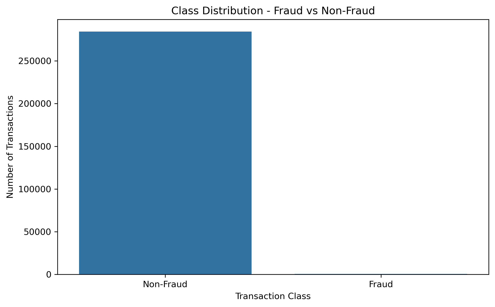
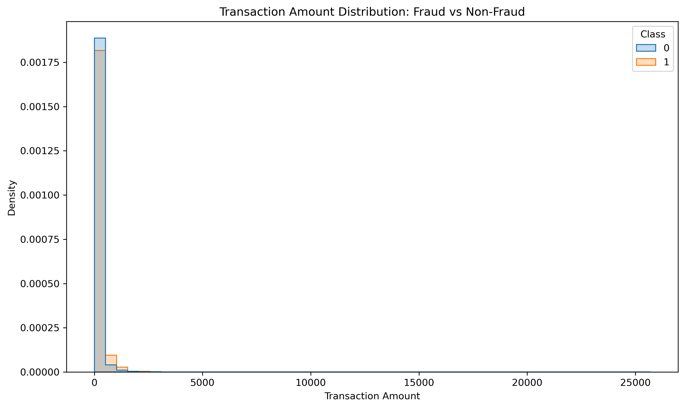
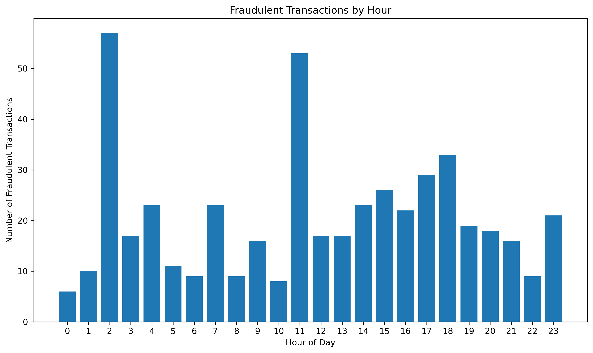
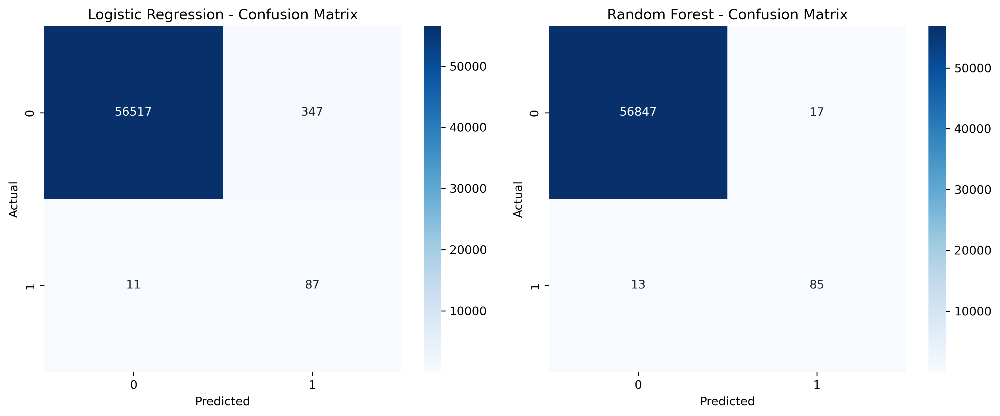
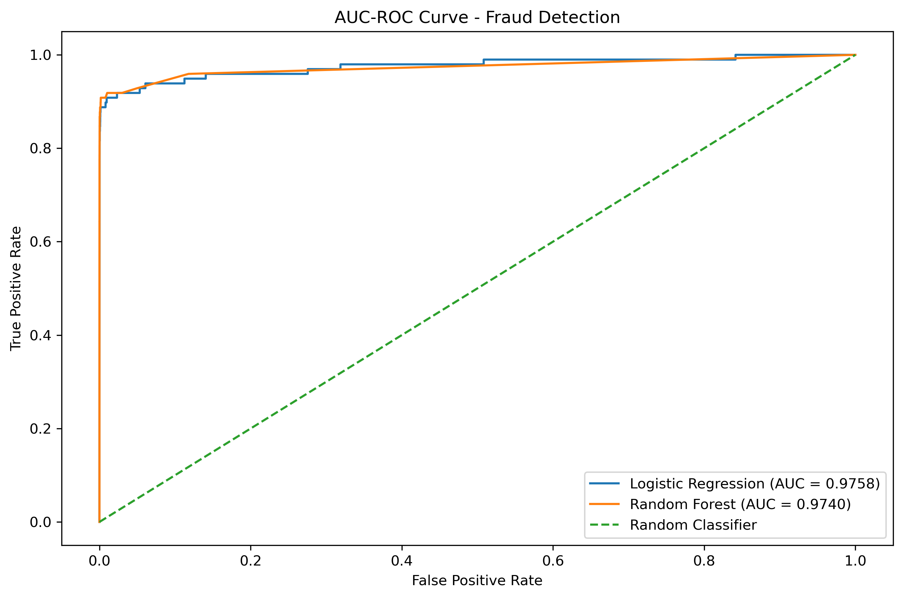
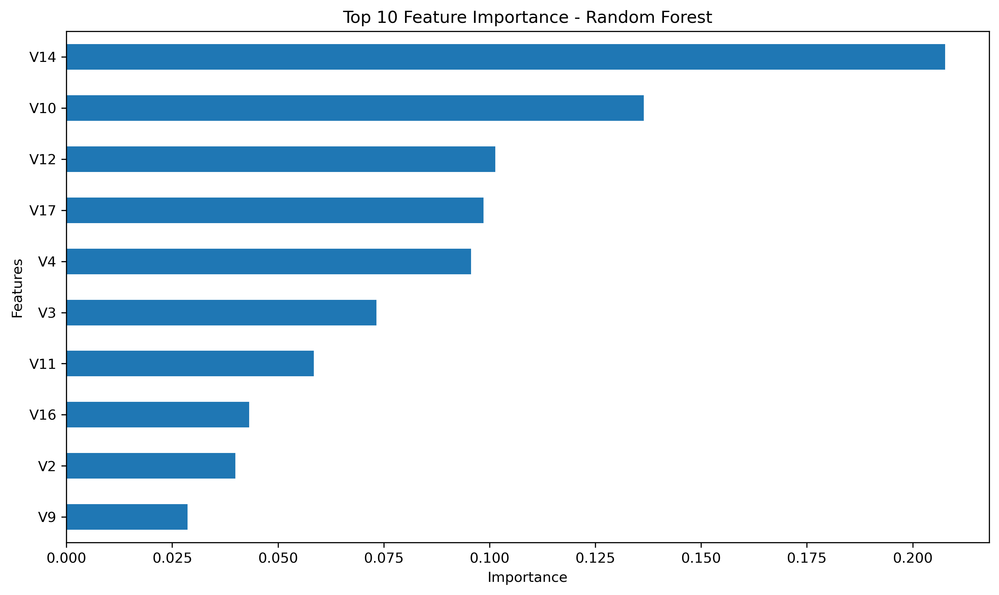
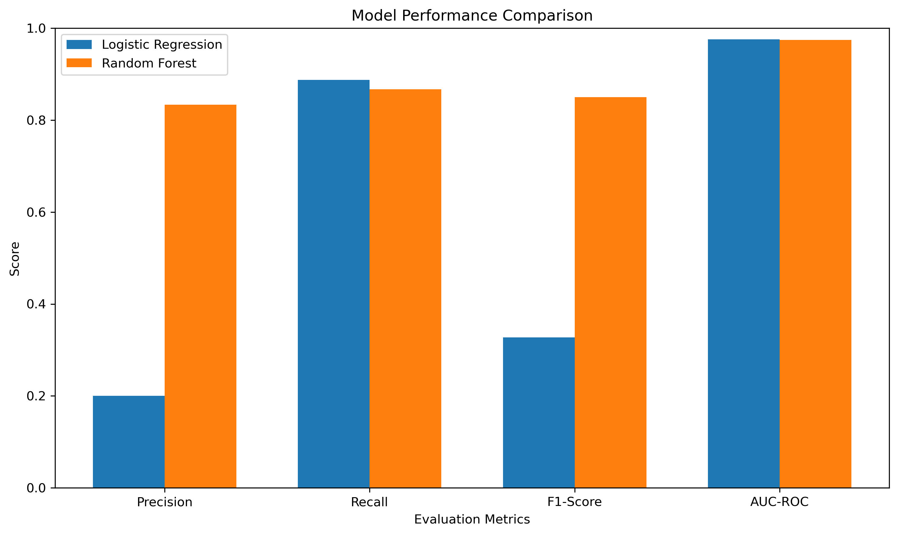

# Fraud Detection

## Project Overview

This project focuses on detecting fraudulent credit card transactions using machine learning techniques. The dataset is highly imbalanced, with fraudulent transactions representing only a very small percentage of all transactions.

The project includes exploratory data analysis, class imbalance handling, model development, evaluation, feature importance analysis, and scalability considerations.

---

## Objective

The main objectives of this project are:

- Analyze the distribution of fraudulent and non-fraudulent transactions.
- Perform exploratory data analysis on transaction amount and time.
- Understand why accuracy alone is not suitable for fraud detection.
- Handle class imbalance using SMOTE.
- Build and compare multiple machine learning models.
- Evaluate models using Precision, Recall, F1-Score, and AUC-ROC.
- Analyze important features contributing to fraud detection.
- Discuss how the solution can scale to large transaction volumes.

---

## Dataset

The project uses the **Credit Card Fraud Detection** dataset.

Dataset characteristics:

- Total transactions: **284,807**
- Non-fraudulent transactions: **284,315**
- Fraudulent transactions: **492**
- Fraud percentage: **approximately 0.1727%**

The dataset contains the following main attributes:

- `Time` – Time elapsed since the first transaction.
- `V1` to `V28` – Anonymized/transformed transaction features.
- `Amount` – Transaction amount.
- `Class` – Target variable:
  - `0` = Non-Fraud
  - `1` = Fraud

Dataset source:

https://www.kaggle.com/datasets/mlg-ulb/creditcardfraud

---

## Technologies Used

- Python
- Pandas
- NumPy
- Scikit-learn
- imbalanced-learn
- Matplotlib
- Seaborn
- Jupyter Notebook

---

## Exploratory Data Analysis

The following analyses were performed:

### 1. Class Imbalance

The dataset contains a very small number of fraudulent transactions compared with legitimate transactions.

Fraudulent transactions account for only approximately **0.1727%** of the complete dataset.

### 2. Transaction Amount Distribution

The distribution of transaction amounts was analyzed separately for fraudulent and non-fraudulent transactions.

### 3. Time-of-Day Analysis

The `Time` feature was converted into a relative hour-of-day representation to analyze the distribution of fraudulent transactions across different hours.

---

## Why Accuracy Can Be Misleading

Accuracy alone is not a reliable metric for this problem because the dataset is extremely imbalanced.

For example, a model that predicts almost every transaction as non-fraud could achieve very high accuracy while still failing to detect many fraudulent transactions.

Therefore, fraud detection requires additional evaluation metrics such as:

- Precision
- Recall
- F1-Score
- AUC-ROC

---

## Data Preprocessing

The following preprocessing steps were performed:

1. Loaded the dataset using Pandas.
2. Separated features and target variable.
3. Performed a stratified train-test split.
4. Applied feature scaling for Logistic Regression.
5. Applied SMOTE only to the training data to address class imbalance.

### SMOTE

Synthetic Minority Over-sampling Technique (SMOTE) was used to increase the representation of fraudulent transactions in the training dataset.

The original training data contained:

- Non-Fraud: **227,451**
- Fraud: **394**

After applying SMOTE:

- Non-Fraud: **227,451**
- Fraud: **113,725**

The test dataset was kept separate and was not oversampled.

---

## Machine Learning Models

Two machine learning models were implemented:

### 1. Logistic Regression

Logistic Regression was used as a baseline classification model for detecting fraudulent transactions.

### 2. Random Forest

Random Forest was implemented as a tree-based ensemble model and was used to capture nonlinear relationships between transaction features.

---

## Model Evaluation

Both models were evaluated using:

- Accuracy
- Precision
- Recall
- F1-Score
- AUC-ROC
- Classification Report
- Confusion Matrix

AUC-ROC curves and confusion matrices were also visualized for model comparison.

The final model selection should consider the balance between fraud detection capability and false-positive rate rather than accuracy alone.

---

## Precision vs Recall Trade-off

In fraud detection, **Recall** is particularly important because missing an actual fraudulent transaction can result in financial loss.

However, maximizing Recall alone can increase false positives.

Therefore:

- **High Recall** → More fraudulent transactions are detected.
- **High Precision** → Fewer legitimate transactions are incorrectly flagged as fraud.
- **F1-Score** → Provides a balance between Precision and Recall.

The appropriate balance depends on the business cost of false positives and false negatives.

---

## Feature Importance

Random Forest feature importance was analyzed to identify the features that contributed most to the model's predictions.

The top important features were visualized using a horizontal bar chart.

---

## Scalability

For a system processing approximately **1 million transactions per hour**, the solution can be scaled using:

- Distributed data processing.
- Batch or streaming pipelines.
- Kafka or similar streaming platforms.
- Parallel model inference.
- Model serving APIs.
- Efficient feature engineering pipelines.
- Continuous monitoring of model performance and data drift.

One million transactions per hour corresponds to approximately **278 transactions per second**, so a production system would require an efficient and scalable architecture.

---

## Project Screenshots

### Class Imbalance

### Transaction Amount Distribution

### Time-of-Day Analysis

### Confusion Matrices

### AUC-ROC Curve

### Feature Importance

### Model Comparison

---

## Conclusion

This project developed a machine learning-based fraud detection pipeline for a highly imbalanced credit card transaction dataset.

Exploratory analysis was performed to understand class imbalance, transaction amount patterns, and the relative time-of-day distribution of fraudulent transactions.

SMOTE was applied to the training data to address class imbalance. Logistic Regression and Random Forest models were then trained and evaluated using Precision, Recall, F1-Score, AUC-ROC, classification reports, and confusion matrices.

Random Forest feature importance was also analyzed to understand the contribution of different transaction features.

For fraud detection, Recall is an important metric because failing to detect fraudulent transactions can have significant consequences. However, Precision and F1-Score are also important because excessive false positives can negatively affect legitimate customers.

The final model should therefore be selected according to the business requirements and the relative cost of false positives and false negatives.